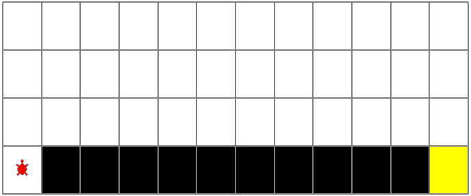
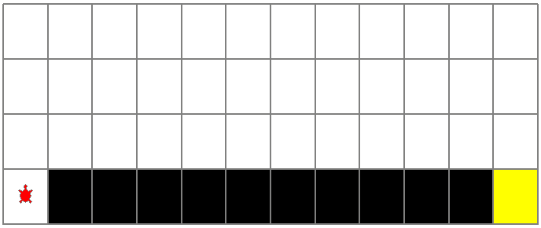

# Value Based Learning(Tabular Version)

## Envirnments

```bash
pip3 install numpy gym
```

## Code

### 1.Sarsa

[sarsa.py](value-based/tabular/sarsa.py)



### 2.Q-Learning

[qlearning.py](value-based/tabular/qlearning.py)



## Test

[train_evaluate.py](value-based/tabular/train_evaluate.py)
